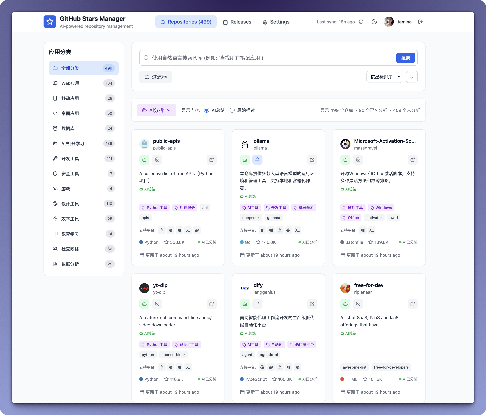
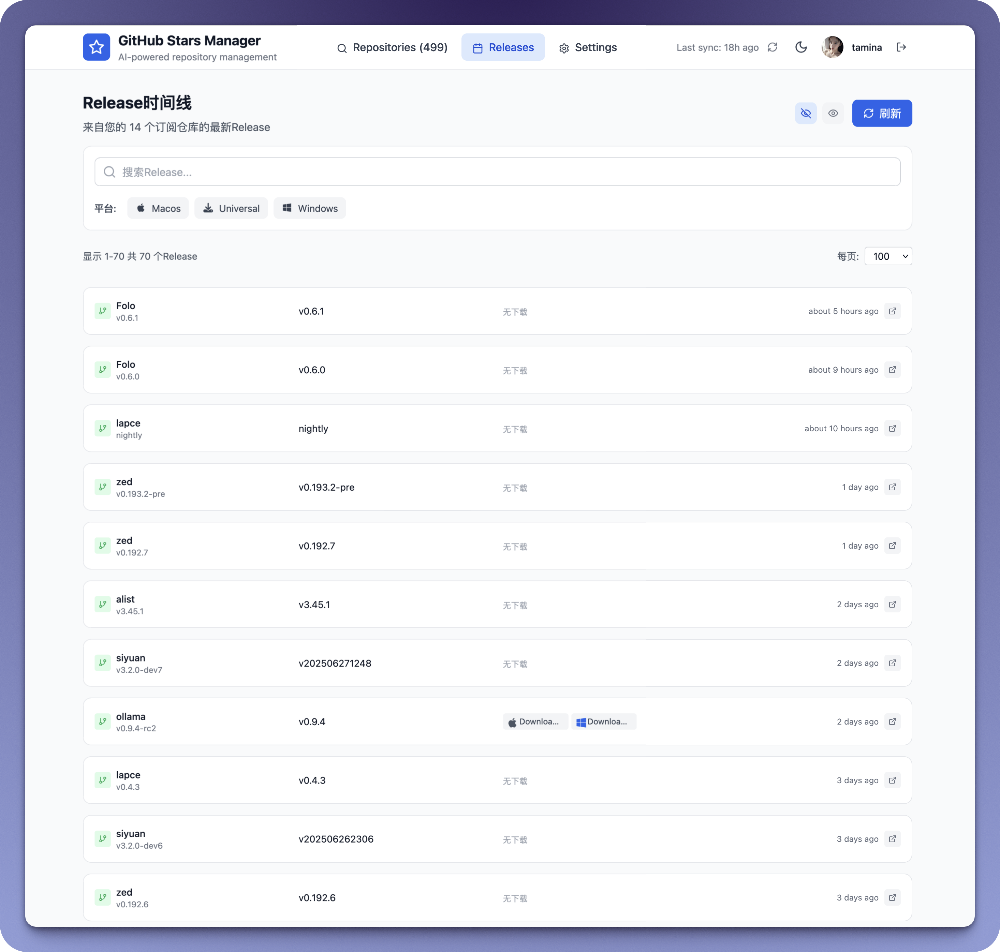
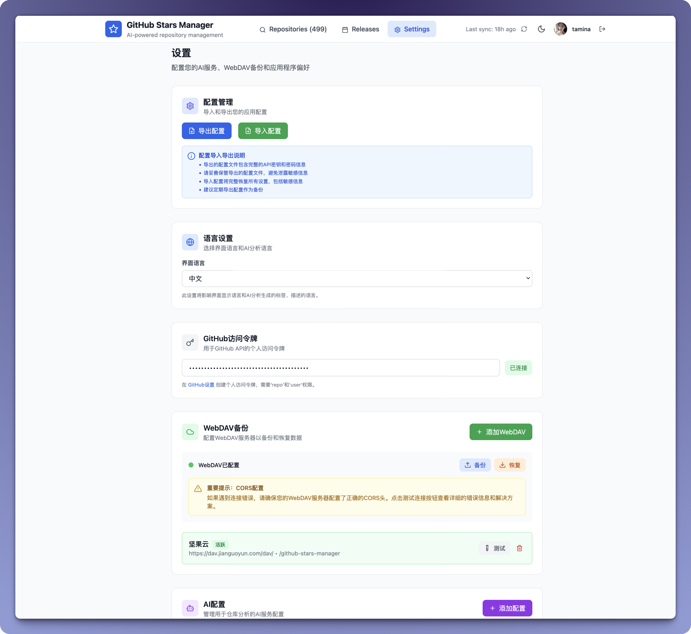

# GithubStarsManager
An app for managing github starred repositories. 

> demo: https://soft-stroopwafel-2b73d1.netlify.app/

##  ✨ Features

### Starred Repo Manager

1. Automatically pull the starred repositories under your github account. You can use AI to automatically analyze the repository and automatically generate repository descriptions, labels, and classifications.
2. through the filter, **natural language search**, you can quickly find the repository.

### Releases view

Subscribe to release notifications in your starred repositories to quickly view and download the released files when they become available.

### Using Custom AI Models

Use your own AI model API that supports OpenAI-compatible interfaces.

## 👋🏻 How to Use

1. Download the source code, or clone the repository
2. Navigate to the directory, and open a Terminal window at the downloaded folder.
3. Run `npm install` to install dependencies and `npm run dev` to build

## Additional Notes

1. There is no backend for this app, so save your important data on your own.
2. I can't write code, this app is entirely written by the AI, mainly for my personal requirment. If you have a new feature or meet a bug, I can only try to do it, but I can't guarantee it, because it depends on the AI to do it successfully.😹
