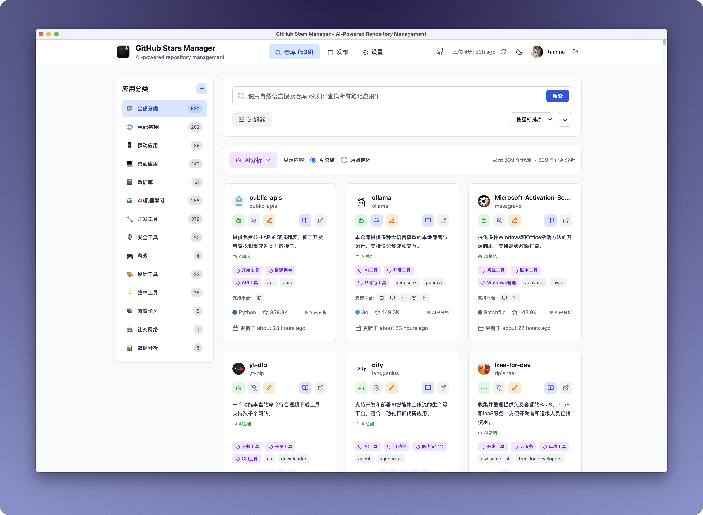
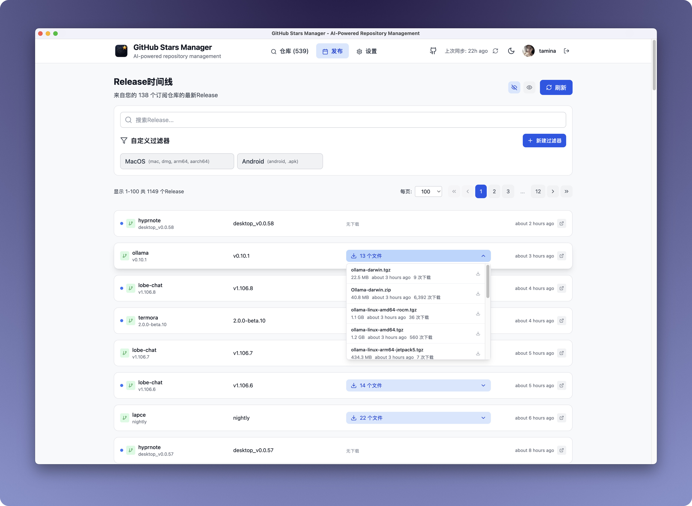
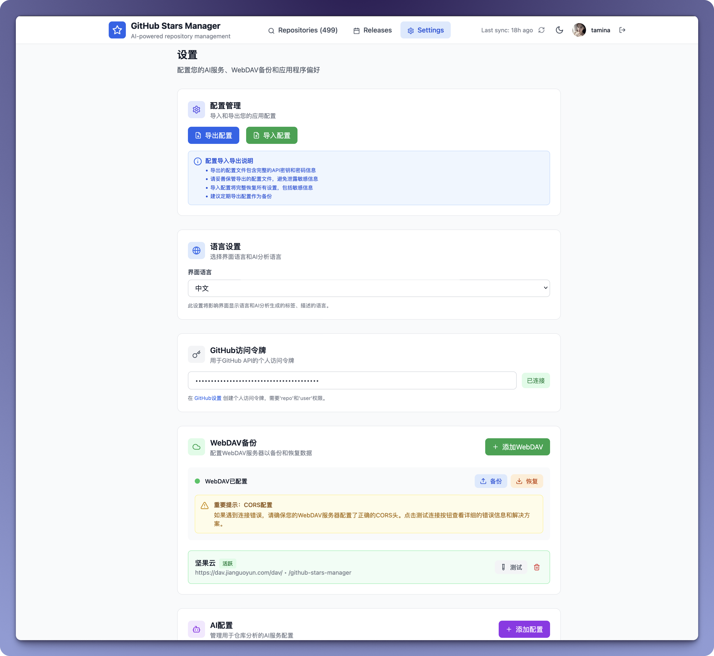

<div align="center">


# GithubStarsManager

  


An intelligent, AI-powered GitHub starred repository manager. Optimized for large star collections, software discovery, and release tracking.

<a href="https://www.producthunt.com/products/githubstarsmanager?embed=true&utm_source=badge-featured&utm_medium=badge&utm_source=badge-githubstarsmanager" target="_blank"></a>

</div>

**[中文文档](README_zh.md)** | English

## ✨ Features

- **🚀 Monolith Architecture**: Single-container deployment. Backend serves frontend on port 3000 (mapped to 8080).
- **📱 PWA Support**: Install as a desktop or mobile app for a native experience.
- **🤖 AI Analysis**: Auto-summarize repository content and generate intelligent tags.
- **📂 Smart Management**: Automatic categorization and custom folders.
- **🔔 Release Tracking**: Subscribe to repo updates and receive notifications via **Apprise**.
- **🔍 Semantic Search**: Find repositories by intent (triggered by `Enter`).
- **👥 Multi-User**: Isolated data with JWT authentication and SuperAdmin role.
- **💾 SQLite Persistence**: All library data stored in the container at `/app/data/data.db`.

## 🚀 Quick Start (Deployment)

### 🐳 Run With Docker (Recommended)

You can run the application instantly using the pre-built image from Docker Hub.

#### Option 1: Docker CLI (Fastest)

```bash
docker run -d -p 8080:3000 \
  -v gsm-data:/app/data \
  --name gsm \
  banjuer/github-stars-manager:latest
```

#### Option 2: Docker Compose

Create a `docker-compose.yml`:

```yaml
version: '3.8'
services:
  app:
    image: banjuer/github-stars-manager:latest
    ports:
      - "8080:3000"
    volumes:
      - app-data:/app/data
    restart: unless-stopped

volumes:
  app-data:
```

Then run:
```bash
docker-compose up -d
```

- **URL**: `http://localhost:8080`
- **First Run**: The first registered user automatically becomes the **SuperAdmin**.
- **Persistence**: Data is saved in the `app-data` volume.

---

### 💻 Desktop Client

Download pre-built binaries for Windows, macOS, and Linux:
[Latest Releases](https://github.com/banjuer/GithubStarsManager/releases)

### 📲 Progressive Web App (PWA)

After deploying to a server (e.g., via Docker), open the URL in Chrome or Edge and click the **Install Icon** in the address bar to add the app to your desktop or mobile home screen.

---

## 🛠 Tech Stack

- **Frontend**: React 18 + TypeScript + Vite + Tailwind CSS
- **PWA**: `vite-plugin-pwa`
- **Backend**: Node.js + Express + SQLite
- **Notifications**: Apprise integration
- **Automation**: node-cron for background release monitoring

## 📊 Feature Highlights

### Starred Repo Manager
AI analyzes repo quality, generates summaries, and matches your interests.


### Release Monitoring
Never miss a tool update. Subscribe and get notified via Apprise.


### AI Configuration
Supports OpenAI, Claude, Ollama, and any OpenAI-compatible provider.


## 🤖 Development Setup

1. **Clone**: `git clone ...`
2. **Install**: `npm install && cd server && npm install`
3. **Run**: `npm run dev:all` (starts frontend on 5174 with proxy to backend on 3000).

---

## Who it's for

- Long-time developers with 1000+ stars.
- Users who need systematic release tracking.
- Enthusiasts wanting to catalog tools with AI assistance.

## Additional Notes

1. The backend is optional but recommended for web deployment. Without it, all data is stored in your browser's localStorage — back up important data regularly.
2. I can't write code, this app is entirely written by the AI, mainly for my personal requirment. If you have a new feature or meet a bug, I can only try to do it, but I can't guarantee it, because it depends on the AI to do it successfully.😹

## 🤝 Contributing

Contributions are welcome!

1. Fork the project
2. Create a feature branch (`git checkout -b feature/AmazingFeature`)
3. Commit your changes (`git commit -m 'Add some AmazingFeature'`)
4. Push to the branch (`git push origin feature/AmazingFeature`)
5. Open a Pull Request

## 📄 License

MIT — see [LICENSE](LICENSE) for details.

## Star History

[](https://www.star-history.com/#banjuer/GithubStarsManager&Date)
